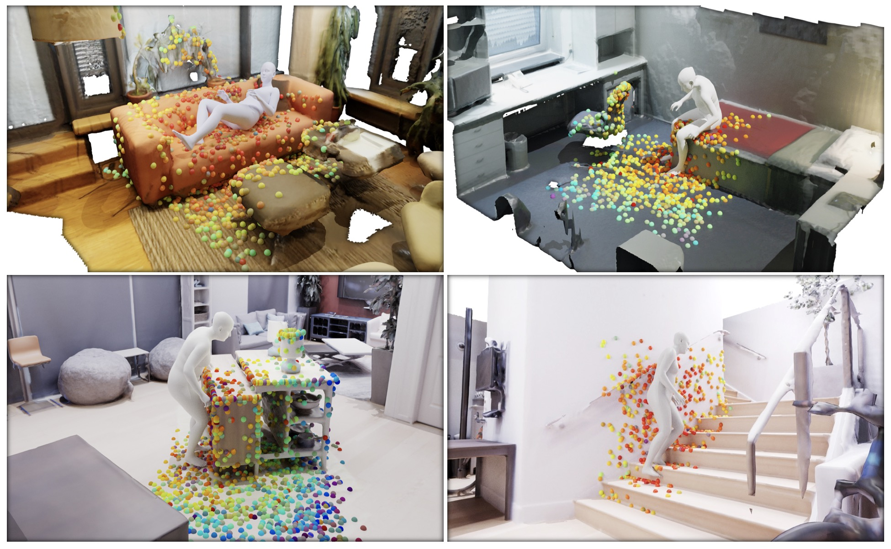

# PLACE: Proximity Learning of Articulation and Contact in 3D Environments 
Official Pytorch implementation for 2020 3DV paper "PLACE: Proximity Learning of Articulation and Contact in 3D Environments"

[[Project]](https://sanweiliti.github.io/PLACE/PLACE.html) [[Paper]](https://arxiv.org/pdf/2008.05570.pdf)
[[2-min Video]](https://www.youtube.com/watch?v=0K6ThmvYFgw&t=5s) [[7-min Video]](https://www.youtube.com/watch?v=zJ1hbtMHGrw&t=1s)





## Installation
The code has been tested on Ubuntu 18.04, python 3.6 and CUDA 10.0. Please install the following packages/models following their instructions:
 * install [SMPL-X](https://sanweiliti.github.io/PLACE/PLACE.html), and download [SMPL-X models](https://smpl-x.is.tue.mpg.de/downloads)
 * install [Chamfer Pytorch](https://github.com/ThibaultGROUEIX/ChamferDistancePytorch/tree/719b0f1ca5ba370616cb837c03ab88d9a88173ff) (source code included in the our repo, `chamfer_pytorch` folder)
 * download the [VPoser model](https://smpl-x.is.tue.mpg.de/downloads) (source code included in the our repo, `human_body_prior` folder)
 
Then run `pip install -r requirements.txt` to install other dependencies.
It is noticed that different versions of `smplx` and `VPoser` will influece generation results.


## Datasets

### PROX
PROX dataset can be downloaded [here](https://prox.is.tue.mpg.de/). The following contents are required for this project:
 * `body_segments` the body segments of PROX
 * `cam2world` camera to world transform matrix
 * `PROXD` body mesh of PROX
 * `sdf` scene SDFs of PROX
 * `scenes` the full scene mesh of PROX (optional)
 * `scenes_downsampled` downsampled scene mesh can be downloaded [here](https://drive.google.com/file/d/1KB1Ic6HSD1a68ioLllxitL0lpVk56FxG/view)

Note that you can use either `scenes` or `scenes_downsampled` for preprocessing / training / testing. In the paper, we use `scenes_downsampled` for the whole pipeline.

### Matterport3D
We use 7 scenes from Matterport3d for evaluation. Please download scene meshes [here](https://github.com/niessner/Matterport)
and download the computed scene SDFs [here](https://drive.google.com/file/d/1A6ecDjPt7hGBaxFI61QVogWNyGon_FJg/view)
Please organize the matterport3D dataset folder as following:
```
mp3d
├── sdf
|   ├── SCENE_NAME_sdf.npy
|   ├── SCENE_NAME.json
├── SCENE_NAME.ply

```
 * 7 scenes used for evaluation: `17DRP5sb8fy-bedroom`, `17DRP5sb8fy-familyroomlounge`, `17DRP5sb8fy-livingroom`, `sKLMLpTHeUy-familyname_0_1`, `X7HyMhZNoso-livingroom_0_16`, `zsNo4HB9uLZ-bedroom0_0`, `zsNo4HB9uLZ-livingroom0_13`
 * `sdf` scene SDFs for room meshes
 * `SCENE_NAME.ply` room meshes
 

### Replica

Download Replica dataset [here](https://github.com/facebookresearch/Replica-Dataset), and organize the dataset folder as following:
```
replica_v1
├── sdf
|   ├── SCENE_NAME_sdf.npy
|   ├── SCENE_NAME.json
├── SCENE_NAME
|   ├── mesh.ply

```
 * 5 scenes used for evaluation: `office_2`, `hotel_0`, `room_0`, `frl_apartment_0`, `apartment_1`


## Trained Checkpoints
The trained checkpoints can be downloaded [here](https://drive.google.com/file/d/1zNFLpJ5m_IjwaEzyJXE7RIUSpZAXmk_q/view?usp=sharing).
Unzip the downloaded `checkpoints` folder, and put it in the project folder.
```
Project
├── checkpoints
|   ├── body_dec_last_model.pkl
|   ├── cVAE_last_model.pkl
|   ├── sceneBpsAE_last_model.pkl
|   ├── sceneBpsVertsAE_last_model.pkl
|── ...

```

## Quick Demo
We provide quick demo `demo.ipynb` to generate random bodies given a scene mesh. 
Please install all required dependencies and download the checkpoints first.


## Preprocessing
Compute the bps encoding and prepare training data with PROX dataset for each scene separately:
```
python compute_bps_encoding.py --dataset_path PATH/TO/PROX --scene_name SCENE/NAME --split train/test --auge_per_sample 4 --preprocess_file_path PATH/TO/PREPROCESS/RESULTS --smplx_model_path PATH/TO/SMPLX/MODEL
```
* training scenes: `BasementSittingBooth`, `MPH8`, `MPH11`, `MPH112`, `N0Sofa`, `N3Library`, `Werkraum`, `N3Office`, set `--split train` and `--auge_per_sample 4`
* testing scenes: `MPH1Library`, `MPH16`, `N0SittingBooth`, `N3OpenArea`, set `--split test` and `--auge_per_sample 1`
* preprocessed data for testing scenes are meant for evaluation of training loss during training

Note each training scene is augmented 4 times (--auge_per_sample 4)
and this preprocessing has a heary requirement for CPU memory.
If you run the preprocess script for each training scene multiple times (e.x., 2 times, then set `--auge_per_sample 2` each time), the preprocessed files can look like:

```
Project
├── preprocessed_encoding
|   ├── BasementSittingBooth_1_rot_list.npy
|   ├── BasementSittingBooth_1_scene_bps_list.npy
|   ├── ...
|   ├── BasementSittingBooth_2_rot_list.npy
|   ├── BasementSittingBooth_2_scene_bps_list.npy
|   ├── ...
|   ├── ...
|   ├── MPH1Library_rot_list.npy
|   ├── MPH1Library_scene_bps_list.npy
|   ├── ...
|   ├── ...
|── ...

```


## Training
With preprocessed data, train the model (remember to modify `train_scene_list` in `train.py` if you run preprocess script each scene multiple times):
```
python train.py --dataset_path PATH/TO/PROX --preprocess_file_path PATH/TO/PREPROCESS/RESULTS --weight_loss_kl 0.5 --weight_loss_contact 0.01 --start_contact_loss 200
```

## Testing and Optimization
Load trained checkpoints, random generate bodies given a scene mesh and implement the interaction-based optimization:
```
python test_optimize.py --optimize --dataset prox/mp3d/replica --dataset_path PATH/TO/DATASET --scene_name SCENE/NAME --prox_dataset_path PATH/TO/PROX --smplx_model_path PATH/TO/SMPLX/MODEL --vposer_model_path PATH/TO/VPOSE/MODEL --save_path PATH/TO/SAVE/RESULTS
```

## Evaluation
Evaluate the physical plausibility metrics of optimized results for each scene, set `--visualize True` to visualize results:
```
python eval_contact_collision.py --dataset prox/mp3d/replica --dataset_path PATH/TO/DATASET --scene_name SCENE/NAME --optimize_result_dir PATH/TO/OPTIMIZE/RESULTS --smplx_model_path PATH/TO/SMPLX/MODEL --vposer_model_path PATH/TO/VPOSE/MODEL
```
Evaluate the diversity metrics for optimized results for all scenes of each dataset:
```
python eval_diversity.py --dataset prox/mp3d/replica --optimize_result_dir PATH/TO/OPTIMIZE/RESULTS --smplx_model_path PATH/TO/SMPLX/MODEL
```


### Citation

When using the code/figures/data/video/etc., please cite our work
```
@inproceedings{PLACE:3DV:2020,
  title = {{PLACE}: Proximity Learning of Articulation and Contact in {3D} Environments},
  author = {Zhang, Siwei and Zhang, Yan and Ma, Qianli and Black, Michael J. and Tang, Siyu},
  booktitle = {International Conference on 3D Vision (3DV)},
  month = nov,
  year = {2020},
  month_numeric = {11}
}
```


## Acknowledgments & Disclosure 
__Acknowledgments.__ We sincerely thank Mohamed Hassan for his scene SDF calculation protocol. This work was partially supported by the German Research Foundation (DFG): SFB 1233, Robust Vision: Inference Principles and Neural Mechanisms, TP XX, project number: 276693517. Qianli Ma acknowledges the support from the Max Planck ETH Center for Learning Systems.

__Disclosure.__ MJB has received research gift funds from Intel, Nvidia, Adobe, Facebook, and Amazon. While MJB is a part-time employee of Amazon, his research was performed solely at MPI. He is also an investor in Meshcapde GmbH.


## Relevant Projects
Generating 3D People in Scenes without People (CVPR 2020)
 ([[paper]](https://arxiv.org/pdf/1912.02923.pdf) [[code]](https://github.com/yz-cnsdqz/PSI-release))